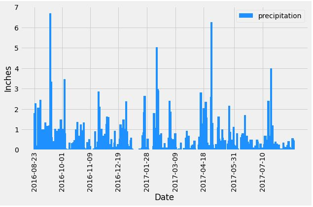
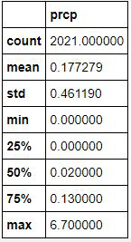
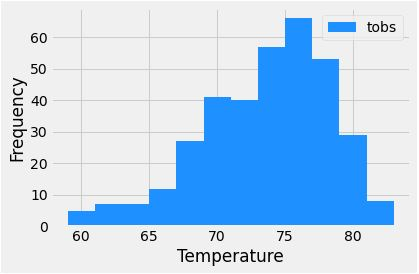

# SQLAlchemy_climate_data

Given a SQLite database of climate data in Honolulu, Hawaii, used Python and SQLAlchemy ORM queries for basic analysis and data exploration.

- - -

Last 12 months of precipitaion data.

- - -

Summary statistics for the precipitation data.

- - -

Last 12 months of temperature observation data from the most active station in the dataset.  Records for station 'USC00519281':

        Location: Waihee 837.5, HI US
        Lowest Temperature Recorded: 54.0
        Highest Temperature Recorded: 85.0
        Average Temperature Recorded: 71.66

